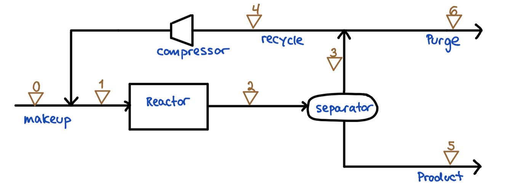
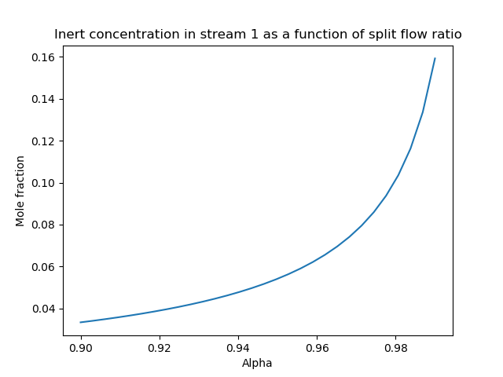

# Ammonia loop

This code computes flow composition in an ammonia loop. It looks at how the split flow ratio changes the inert concentration in the reactor's inlet stream.

A gas phase reaction between nitrogen (N2) and hydrogen (H2) produces NH3. The chemical reaction is: N2 + 3H2 = 2NH3.

A recycle is introduced because not all N2 and H2 are converted to NH3.

A purge is introduced because inert Ar is in the make up stream (stream 0), which will clump up in the system if not taken out through a purge.

A flow chart of the process is presented below.

## Makeup-stream (stream 0):
N2: 240 kmol/h

H2: 750 kmol/h

NH3: 0

Ar: 10 kmol/h

## Mixer
Combines stream 0 and stream 4 to stream 1.

## Reactor
30% of all N2 in stream 1 is converted to ammonia:

,

Stoichiometry matrix:

,

Conversion matrix:
,

Mole balance reactor:

.

## Separator
Assuming all Argon ends up in the gas phase and all ammonia ends up in the liquid phase.

99% of all H2 and 98% of all N2 goes to the gas phase. 

Separator factors: ,

,

,

## Split
5% of stream 3 goes to purge. 95% is recycled.

Split flow ratio: .

,

.

## Loop

,

Let ,

By solving this equation using scipy.linalg, F4 will be known. From F4, all other flows can be calculated.

## Recycle ratio
Recycle ratio is the ratio between the the recycle stream (stream 4) and the make up stream (stream 0).

## Split flow ratio and inert concentration
By changing the split flow ratio from 0.9 to 0.99, the inert concentration in stream 1 will increase. A plot is presented below.

When no flow is let out through the purge, the inert will continue to circulate in the process as well as added through the make up stream. Thus, the inert concentration in the process increase. This is the reason why the purge is installed.

