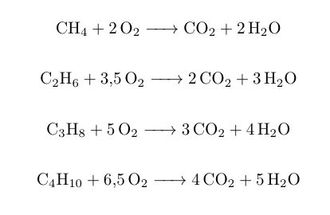
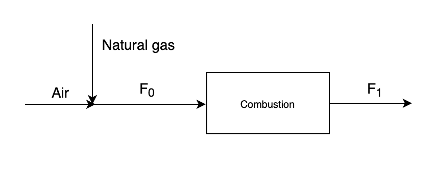
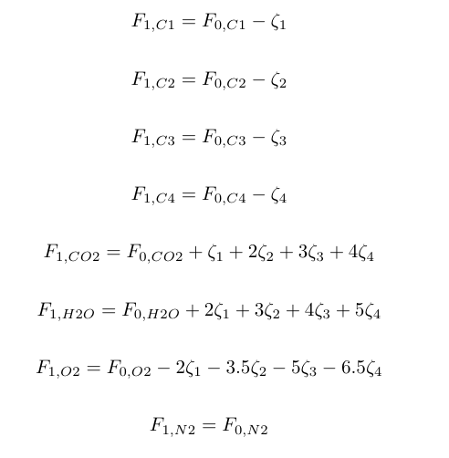
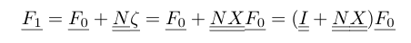

# Combustion of natural gas

Simulation of combustion of natural gas in with air.

Natural gas consist of 80% methane, 10% ethane, 5% propane and 5% butane.

Assuming air consists of 21% O2 and 79% N2. Air is added in 20% excess O2.

The reactions are given below. Assuming complete combustion.

A flow chart of the process is presented below.

Mole balances of methane (C1), ethane (C2), propane (C3), butane (C4), CO2, H2O, O2 and N2 are given below, where  is the reaction extent of reaction *i*.

This can be formulated in vector notation, and this is the equation used in the python-code.

