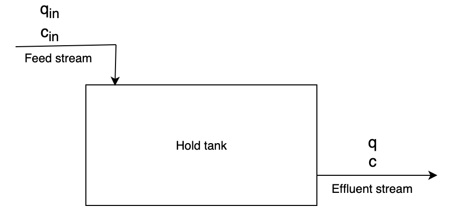

# Hold tank

"Hold tank" is a dynamic simulation problem.

The system is a perfectly mixed hold tank with an inflow and outflow (CSTR). It is installed in an aqueous effluent-treatment process to floctuations in concentration of the effluent stream. Normally the effluent stream containts maximum 100 ppm acetone, and the maximum allowable concentration of acetone in the effluent discharge is 200 ppm. 

Due to a spill in the process plant, the acetone concentration in the feed suddenly rises to 1000 ppm for 30 min. Will the acetone concentration in the effluent stream exceed 200 ppm?

The tank has a constant volume of 500 m3. The feed stream and effulent stream are at constant volume flow 45 m3/h.

Mole balance of acetone:
,
where *V* is the volume of the tank, *c* is the concentration in the effulent stream and in the tank,  is the feed concentration, *q* is the volume flow of the effulent stream and  is the volume flow of the feed stream.

Assuming constant volume V and equal volume flows in and out of the tank , the mole balance simplifies to:

Introducing residence time:  simplifies the mole balance:

.

This is a differential equation we can solve. However, we have concentrations given in *ppm*, so the mole balance must be converted from concentration *c* to mole fraction *x*:

, where  is the total concentration in the tank. 

This gives: , which can be simplified to

. This is an ordinary differential equation which can be solved using the initial condition  and inlet mole fraction 

Using odeint from scipy.integrate, we get that when t = 0.5 hour, x = 139.6 ppm, which is is below the maximum allowable concentration. 

